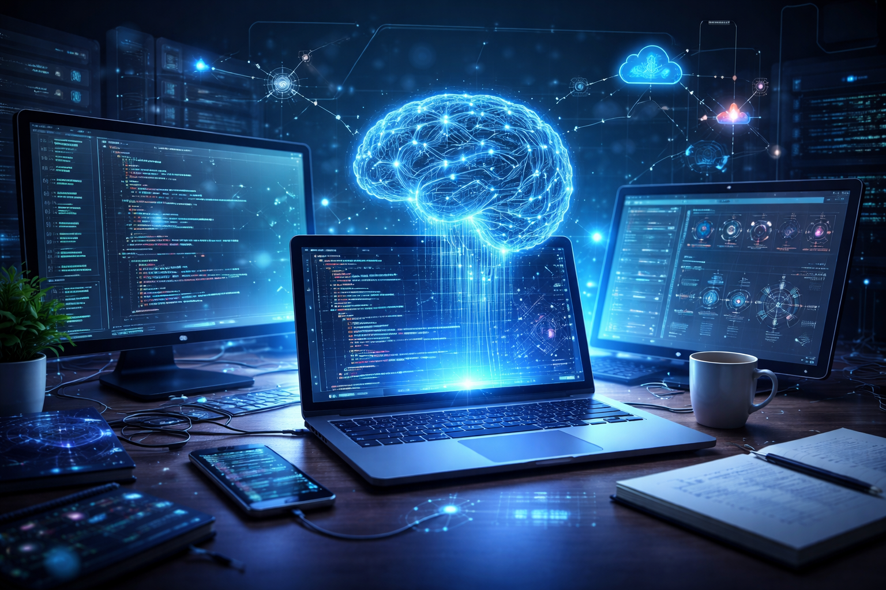

  

I am an AI/ML Engineer with a Master’s degree in Human Language Technology and a background in Electrical Engineering, specializing in natural language processing, data pipelines, and applied machine learning. My work focuses on building end-to-end systems that transform large, complex, and often unstructured data into structured, actionable insights.

My interest in this field began during the last year of my undergraduate studies in Electrical Engineering in Colombia, where I learned about classifiers, machine learning, and neural networks, and developed a passion for how computational methods can model, process, and extract meaning from real-world data.

During my Master’s program in Human Language Technology, I developed a strong foundation in statistical natural language processing and quantitative methods for linguistic data. I worked with core NLP techniques such as n-gram modeling, document classification, and information retrieval, and applied statistical methods including regression modeling, hypothesis testing, and mixed-effects modeling.

During my internship at Goods Unite Us, I developed scalable data pipelines integrating multiple data sources, including SEC filings, web-based data, and company datasets. My work involved extracting executive information, resolving company identities, and linking corporate data to external sources.

In addition to industry experience, I have conducted research involving multilingual corpora, statistical modeling, and machine learning, including building annotated datasets and designing psycholinguistic experiments using eye-tracking and self-paced listening.

My technical toolkit includes Python (pandas, NumPy, scikit-learn, NLTK, spaCy, Transformers, PyTorch, TensorFlow), R (tidyverse, ggplot2, quanteda), SQL, and cloud platforms. I am particularly interested in solving real-world problems where data is messy, ambiguous, and large-scale.

I am currently seeking full-time opportunities in Artificial Intelligence, Machine Learning, or Data Analytics where I can contribute to building data-driven systems that create measurable impact.

